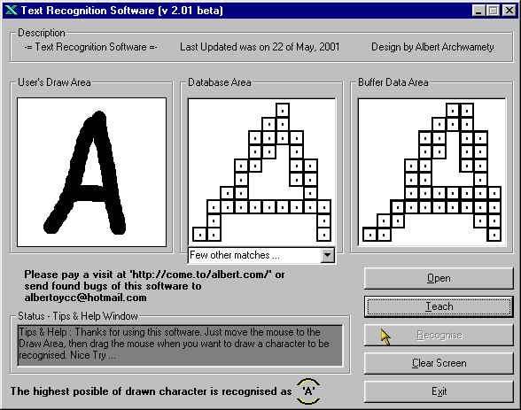



## Text Recognition Software v2\.01 beta

### Description

A program designed to recognize user input of different patterns, like letters, and numbers. It is pre-programmed or pre-teach already for numbers and alphabets, and it is possible to teach new characters. It was programmed by Albert Archwamety. esspecially in subject of IMAGE PROCESSING and Robotics. With VB sourcecode. OCR programming.
 
### More Info
 

             |
---                |---
**Submitted On**   |2002-01-17 17:16:10
**By**             |[Albert Archwamety](https://github.com/Planet-Source-Code/PSCIndex/blob/master/ByAuthor/albert-archwamety.md)
**Level**          |Advanced
**User Rating**    |4.8 (82 globes from 17 users)
**Compatibility**  |VB 6\.0
**Category**       |[Miscellaneous](https://github.com/Planet-Source-Code/PSCIndex/blob/master/ByCategory/miscellaneous__1-1.md)
**World**          |[Visual Basic](https://github.com/Planet-Source-Code/PSCIndex/blob/master/ByWorld/visual-basic.md)
**Archive File**   |[Text\_Recog1532931222003\.zip](https://github.com/Planet-Source-Code/albert-archwamety-text-recognition-software-v2-01-beta__1-42632/archive/master.zip)

